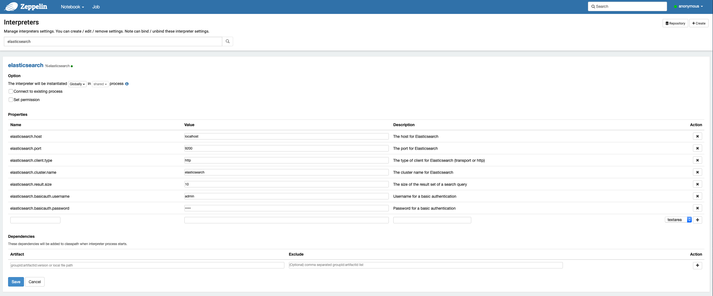
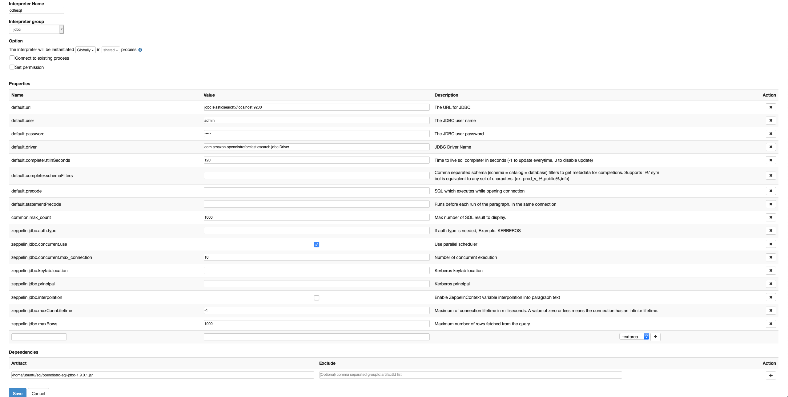

# Zeppelin Backend Adaptor

## Contents

1. [**Zeppelin Backend Service**](#zeppelin-backend-service)
2. [**Apache Zeppelin Setup**](#apache-zeppelin-setup)

## Zeppelin Backend Service

**Apache Zeppelin** provides several REST APIs for interaction and remote activation of zeppelin functionality. All REST APIs are available starting with the following endpoint `http://[zeppelin-server]:[zeppelin-port]/api`.


1. **APIs Provided:**
   1. **[Server:](http://zeppelin.apache.org/docs/0.9.0-preview1/usage/rest_api/zeppelin_server.html)** Get status, version, Log Level
   2. **[Interpreter:](http://zeppelin.apache.org/docs/0.9.0-preview1/usage/rest_api/interpreter.html)** Get interpreter settings, create/update/restart/delete interpreter setting
   3. **[Notebook:](http://zeppelin.apache.org/docs/0.9.0-preview1/usage/rest_api/notebook.html)** Create/update/restart/delete note and paragraph ops
   4. **[Repository:](http://zeppelin.apache.org/docs/0.9.0-preview1/usage/rest_api/notebook_repository.html)** Get/Update NB repo
   5. **[Configuration:](http://zeppelin.apache.org/docs/0.9.0-preview1/usage/rest_api/configuration.html)** Get all [Zeppelin config](http://zeppelin.apache.org/docs/0.9.0-preview1/setup/operation/configuration.html) - server port, ssl, S3 bucket, S3.user
   6. **[Credential:](http://zeppelin.apache.org/docs/0.9.0-preview1/usage/rest_api/credential.html)** List credentials for all users, create/delete
   7. **[Helium:](http://zeppelin.apache.org/docs/0.9.0-preview1/usage/rest_api/helium.html)** Contains APIs for all plugin packages (Not needed as of now)
2. **Security:**
   1. By default the APIs are exposed to anonymous user
   2. Recommended way to use **access control**: **[Shiro Auth](http://zeppelin.apache.org/docs/0.9.0-preview1/setup/security/shiro_authentication.html)**
      1. Need to change [**Shiro.ini (Apache link)**](http://shiro.apache.org/configuration.html#ini-sections) in conf directory
      2. Ideally should be used with [**Apache KnoxSSO**](https://knox.apache.org/books/knox-0-13-0/dev-guide.html#KnoxSSO+Integration)
      3. Also, [Notebooks](http://zeppelin.apache.org/docs/0.9.0-preview1/setup/security/notebook_authorization.html) can have access control based on Shiro defined users
3. **Deployment:**
   1. Recommended way is to use stand alone docker
   2. Create a **custom docker** with new Shiro & Zeppelin configs and set interpreter config for Elasticsearch and ODFE-sql.
   3. Sample scripts available in `scripts/docker/spark-cluster-managers`
4. **Storage:**
   1. Apache Zeppelin has a pluggable notebook storage mechanism controlled by `zeppelin.notebook.storage` configuration option with multiple implementations.
   2. Zeppelin has** built-in S3/github connector**. Just provide credentials in [properties or env-sh](http://zeppelin.apache.org/docs/0.9.0-preview1/setup/storage/storage.html#notebook-storage-in-s3)
   3. The notebooks are automatically synced by Zeppelin

## **Apache Zeppelin Setup**

- https://zeppelin.apache.org/
- Web-based notebook that enables data-driven, interactive data analytics and collaborative documents with SQL, Scala and more.
- **[Installation Steps](http://zeppelin.apache.org/docs/0.9.0-preview1/quickstart/install.html)**
  - http://zeppelin.apache.org/download.html → Install using Binary package with all interpreters.
  - Unpack the downloaded tar
  - To Run the service use `bin/zeppelin-daemon.sh start`
  - To Stop the service use `bin/zeppelin-daemon.sh stop`
  - Service starts on port 8080
  - If on a remote server (like ec2) and want to use server IP to access the notebook:
    - Make sure your inbound/outbound ports are set correctly on the remote machine
    - You may want to change the Zeppelin host ip to 0.0.0.0 (or keep it localhost)
    - To change the host ip use the `zeppelin-site.xml.template` inside “conf/“ directory
    - `cp conf/zeppelin-site.xml.template conf/zeppelin-site.xml`
    - `vi conf/zeppelin-site.xml` and edit the host ip
    - Then restart the service
- **[Optional] Setup ES Interpreter:**

  - [Zeppelin Elasticsearch interpreter Documentation](https://zeppelin.apache.org/docs/0.9.0-preview2/interpreter/elasticsearch.html)
  - This interpreter can be used for ODFE:

    - **Note: current issues with Elasticsearch Interpreter in Zeppelin**
    - User needs to remove ssl flag from the ES config as Zeppelin doesn’t support ssl request yet: https://issues.apache.org/jira/browse/ZEPPELIN-2031 so run the ODFE service without ssl enabled
    - Zeppelin has “no support for ssl” (only uses http) in elastic interpreter:
      - [Code](https://github.com/apache/zeppelin/blob/0b8423c62ae52f3716d4bb63d60762fee6910788/elasticsearch/src/main/java/org/apache/zeppelin/elasticsearch/client/HttpBasedClient.java#L105)
      - [Apache Issues](https://issues.apache.org/jira/browse/ZEPPELIN-2031)
    - Zeppelin has “no issue in search query” in elastic interpreter:
      - [Apache Issues](https://issues.apache.org/jira/browse/ZEPPELIN-4843?jql=project%20%3D%20ZEPPELIN%20AND%20status%20%3D%20Open%20AND%20text%20~%20%22elasticsearch%22)
    - Zeppelin “No support for search template“ issue in elastic interpreter:
      - [Apache Issues](https://issues.apache.org/jira/browse/ZEPPELIN-4184?jql=project%20%3D%20ZEPPELIN%20AND%20text%20~%20%22elastic%20search%22)
    - **To Change the interpreter settings of Elastic Search Interpreter on Zeppelin:**
      - Open Zeppelin in browser `localhost:8080`
      - Please click the top right menu beside drop down and select interpreter option
      - In the interpreters window, search for elasticsearch interpreter
      - Edit config parameters similar to that your local/remote service
      - You’ll be prompted to restart the interpreter -> Click on ok
    - **If using the default settings, add below mentioned changes in interpreter config:**

      - Change transport.type to http
      - host → localhost (if running on same machine as Zeppelin) & port → 9200
      - username: admin & password: admin
      - Once configured the screen should look like this:
        

    - Start a new notebook to try out the below commands
    - Run a shell command from notebook to check availability of ES:
      - `%sh curl -XGET http://localhost:9200 -u admin:admin`

```
%elasticsearch
index movies/default/1 {
    "title": "The Godfather",
    "director": "Francis Ford Coppola",
    "year": 1972,
    "genres": ["Crime", "Drama"],
    "rating":5
}
```

- **[Optional] Setup ODFE-SQL JDBC Interpreter:**
  - [Zeppelin JDBC Interpreter Documentation](https://zeppelin.apache.org/docs/0.9.0-preview2/interpreter/jdbc.html)
  - Zeppelin has a generic JDBC interpreter, we can use this to add our ODFE-SQL Driver
  - Download [ODFE-SQL Driver](https://opendistro.github.io/for-elasticsearch/downloads.html) Jar file
  - To Use JDBC interpreter:
    - **To add the JDBC interpreter settings for ODFE-SQL:**
      - Open Zeppelin in browser `localhost:8080`
      - Please click the top right menu beside drop down and select interpreter option
      - Click on "+ Create" Button
      - Add ODFE-SQL interpreter with type JDBC **configure name: “odfesql”**
      - Note: The name you assign to the interpreter is used later for accessing paragraphs in notebook - “%odfesql”
      - Edit config for with ODFE-SQL Driver details (Please refer to the [Github README](https://github.com/opendistro-for-elasticsearch/sql-jdbc))
    - **If using the default settings, add below mentioned changes in interpreter config:**
      - Edit the url: `jdbc:elasticsearch://localhost:9200`
      - Edit the driver class: `com.amazon.opendistroforelasticsearch.jdbc.Driver`
      - Edit the username to admin
      - Edit the password to admin
      - Add absolute path to the Jar in the last input box
      - You’ll be prompted to restart the interpreter -> Click on ok
      - Once configured the screen should look like this:
        
        
    - Open a notebook and run below commands to check if interpreter settings are set correctly

```
%odfesql
SELECT * FROM movies
```

- **Appendix:**
  - **[More on Zeppelin UI](http://zeppelin.apache.org/docs/latest/quickstart/explore_ui.html)**
  - [**More on Zeppelin Config**](http://zeppelin.apache.org/docs/latest/setup/operation/configuration.html)
  - [**S3-Notebook Storage**](http://zeppelin.apache.org/docs/0.8.2/setup/storage/storage.html#notebook-storage-in-s3)
